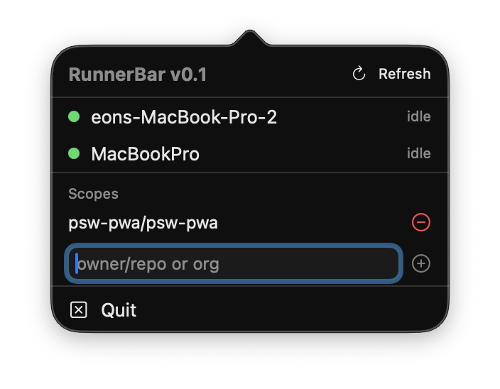

<div align="center">

<br/>

# RunnerBar

### Self-hosted GitHub Actions runners, at a glance in your macOS menu bar.

<br/>

[](https://developer.apple.com/macos/)
[](https://swift.org)
[](Package.swift)
[](build.sh)
[](https://eonist.github.io/runner-bar/version.txt)
[](#-install)

<br/>



<br/>

```bash
curl -fsSL https://eonist.github.io/runner-bar/install.sh | bash
```

<sub>One command. No Xcode. No Apple Developer account. No Gatekeeper dialog.</sub>

<br/>

</div>

**RunnerBar** is a tiny macOS menu-bar app for developers running self-hosted GitHub Actions runners on their Mac. Instead of opening a browser and clicking through every repo or org to check runner status, a single colored dot tells you at a glance: green if every runner is online, orange if some aren't, red if none are. Click the dot for a list of every runner with an `idle` / `active` / `offline` badge.

It's built to stay out of your way — no Dock icon, no login prompts, no tokens to paste. Auth is reused from the [`gh`](https://cli.github.com) CLI you already have.

<br/>

## Table of contents

- [Install](#-install)
- [Getting started](#-getting-started)
- [Features](#-features)
- [Status reference](#-status-reference)
- [Requirements](#-requirements)
- [How it works](#-how-it-works)
- [Project layout](#-project-layout)
- [Build from source](#-build-from-source)
- [Out of scope for v0.1](#-out-of-scope-for-v01)
- [FAQ](#-faq)
- [Contributing](#-contributing)
- [Docs](#-docs)

<br/>

---

## 📦 Install

```bash
curl -fsSL https://eonist.github.io/runner-bar/install.sh | bash
```

The installer downloads `RunnerBar.zip` from GitHub Pages, replaces any existing `/Applications/RunnerBar.app`, unzips the new bundle into `/Applications`, and launches it. The menu-bar dot appears immediately. See [DEPLOYMENT.md](DEPLOYMENT.md) for why Gatekeeper doesn't fire.

**Uninstall:**

```bash
rm -rf /Applications/RunnerBar.app
defaults delete dev.eonist.runnerbar 2>/dev/null || true
```

<br/>

---

## 🚀 Getting started

You'll be running in under a minute.

| Step | Action |
|:---:|---|
| 1 | Install and sign in to `gh` once — `brew install gh && gh auth login` |
| 2 | Install RunnerBar with the `curl` command above |
| 3 | Click the menu-bar dot to open the popover |
| 4 | Add a scope — `owner/repo` or a bare `org-name` — then press `+` |
| 5 | Done — RunnerBar polls every 30 seconds |

Optional: toggle **Launch at login** in the popover so RunnerBar starts with your Mac.

<br/>

---

## ✨ Features

- **Traffic-light menu-bar icon** — `systemGreen`, `systemOrange`, or `systemRed`, drawn programmatically in [`StatusIcon.swift`](Sources/RunnerBar/StatusIcon.swift).
- **Runner list popover** — each row shows the runner's name and an `idle` / `active` / `offline` badge. See [`PopoverView.swift`](Sources/RunnerBar/PopoverView.swift).
- **In-popover sign-in** — if `gh` isn't authenticated, a **Sign in with GitHub** button opens Terminal running `gh auth login`; otherwise a green "Authenticated" indicator is shown.
- **Scopes managed in-app** — add or remove `owner/repo` slugs and org names from the popover; persisted in `UserDefaults`. See [`ScopeStore.swift`](Sources/RunnerBar/ScopeStore.swift).
- **30-second auto-polling** — a `Timer` in [`RunnerStore.swift`](Sources/RunnerBar/RunnerStore.swift) refreshes every configured scope in the background.
- **Launch at login** — a single checkbox, backed by `SMAppService`. See [`LoginItem.swift`](Sources/RunnerBar/LoginItem.swift).
- **Menu-bar only** — `LSUIElement=true` in [`Info.plist`](Resources/Info.plist), so there's no Dock icon and no app-switcher entry.
- **Universal and tiny** — one arm64 + x86_64 binary, ad-hoc signed by [`build.sh`](build.sh).

> **v0.1 is read-only.** RunnerBar shows runner state. It does not register, start, stop, or restart runners, and does not surface workflow logs. See [Out of scope](#-out-of-scope-for-v01) for the full list of deferred features.

<br/>

---

## 🚦 Status reference

**Menu-bar icon** — aggregated across all configured scopes by [`RunnerStore.aggregateStatus`](Sources/RunnerBar/RunnerStore.swift):

| Color | Case | Meaning |
|:---:|---|---|
| 🟢 Green | `allOnline` | Every runner reports `status == "online"` |
| 🟠 Orange | `someOffline` | At least one runner is online, at least one isn't |
| 🔴 Red | `allOffline` | No runners are online, or no scopes are configured |

**Runner row badge** — per runner, rendered inline in [`PopoverView.swift`](Sources/RunnerBar/PopoverView.swift):

| Badge | Condition |
|---|---|
| `idle` | `status == "online"` and `busy == false` |
| `active` | `status == "online"` and `busy == true` |
| `offline` | anything else |

<br/>

---

## 🧾 Requirements

| | |
|---|---|
| **macOS** | 13 Ventura or later |
| **Architecture** | Apple Silicon or Intel (universal binary) |
| **[`gh` CLI](https://cli.github.com)** | Installed and authenticated — `brew install gh && gh auth login` |

RunnerBar never stores a token. It resolves auth at runtime in this order — see [`Auth.swift`](Sources/RunnerBar/Auth.swift):

1. `gh auth token`
2. `GH_TOKEN` environment variable
3. `GITHUB_TOKEN` environment variable

<br/>

---

## 🧠 How it works

```text
 menu-bar dot  ◀── StatusIcon  ◀── RunnerStore.aggregateStatus
                                         ▲
                                         │  30s Timer
                                         │
                                    GitHub.swift  ◀── ScopeStore (UserDefaults)
                                         │
                                    gh api /repos/{owner}/{repo}/actions/runners
                                    gh api /orgs/{org}/actions/runners
                                         │
                                    [Runner] (id, name, status, busy)
```

1. [`ScopeStore`](Sources/RunnerBar/ScopeStore.swift) stores the scopes you've added in `UserDefaults` under the key `scopes`.
2. [`RunnerStore`](Sources/RunnerBar/RunnerStore.swift) runs a `Timer` on a 30-second cadence and fetches every scope on a background queue each tick.
3. [`GitHub.swift`](Sources/RunnerBar/GitHub.swift) shells out to the `gh` CLI:
   - Scope contains `/` → `gh api /repos/{owner}/{repo}/actions/runners`
   - Otherwise → `gh api /orgs/{org}/actions/runners`
4. Responses decode into [`Runner`](Sources/RunnerBar/Runner.swift) values (`id`, `name`, `status`, `busy`).
5. `RunnerStore.aggregateStatus` collapses the combined list to `allOnline` / `someOffline` / `allOffline`, which drives the menu-bar icon via [`StatusIcon`](Sources/RunnerBar/StatusIcon.swift).

<br/>

---

## 🗂 Project layout

```text
runner-bar/
├── Package.swift                 # SwiftPM manifest — the only build config
├── Sources/RunnerBar/
│   ├── main.swift                # NSApp bootstrap
│   ├── AppDelegate.swift         # NSStatusItem + NSPopover wiring
│   ├── StatusIcon.swift          # Traffic-light dot
│   ├── PopoverView.swift         # SwiftUI popover UI
│   ├── RunnerStore.swift         # 30s polling + aggregate status
│   ├── Runner.swift              # Runner model
│   ├── RunnerMetrics.swift       # Local CPU/MEM via `ps` (model-layer helper)
│   ├── GitHub.swift              # `gh api` shell-outs
│   ├── ScopeStore.swift          # UserDefaults-backed scope list
│   ├── LoginItem.swift           # SMAppService launch-at-login
│   ├── Auth.swift                # Token resolution
│   └── Shell.swift               # shell() helper (zsh -c)
├── Resources/Info.plist          # LSUIElement=true, bundle metadata
├── build.sh                      # swift build → .app bundle → ad-hoc sign → zip
├── deploy.sh                     # push dist/ to gh-pages via git worktree
└── install.sh                    # curl | bash installer (also on gh-pages)
```

<br/>

---

## 🛠 Build from source

SwiftPM only — no Xcode project, no Interface Builder.

```bash
git clone https://github.com/eonist/runner-bar
cd runner-bar
swift run          # develop
swift build        # fast error check
bash build.sh      # universal release .app in ./dist
```

[`build.sh`](build.sh) runs `swift build -c release --arch arm64 --arch x86_64`, assembles `dist/RunnerBar.app`, signs it ad-hoc, and produces `dist/RunnerBar.zip` plus `dist/version.txt`. Full loop in [DEVELOPMENT.md](DEVELOPMENT.md); release flow in [DEPLOYMENT.md](DEPLOYMENT.md).

<br/>

---

## 🚧 Out of scope for v0.1

RunnerBar v0.1 is intentionally minimal — read-only visibility and nothing more. The following are **not** in the app and are **not** planned for v0.1:

- Registering or adding new runners
- Starting, stopping, or restarting runner processes
- Workflow run history or job logs
- Desktop notifications
- Multi-account or GitHub Enterprise Server support
- CPU / memory values in the popover *(the model-layer helper exists in [`RunnerMetrics.swift`](Sources/RunnerBar/RunnerMetrics.swift), but [`PopoverView.swift`](Sources/RunnerBar/PopoverView.swift) does not render it)*

Full v0.1 spec: [issue #1](https://github.com/eonist/runner-bar/issues/1). What's next: [open issues](https://github.com/eonist/runner-bar/issues).

<br/>

---

## ❓ FAQ

<details>
<summary><strong>Do I need a Personal Access Token?</strong></summary>

No. RunnerBar reuses the session `gh auth login` created. To pin a specific token instead, export `GH_TOKEN` or `GITHUB_TOKEN` before launching the app.
</details>

<details>
<summary><strong>The popover says "Sign in with GitHub" but I'm already signed into github.com.</strong></summary>

Auth comes from the `gh` CLI, not the browser. Run `brew install gh && gh auth login` and reopen the popover.
</details>

<details>
<summary><strong>I installed it but don't see anything.</strong></summary>

RunnerBar has no Dock icon (`LSUIElement=true`). Look for a small colored circle on the right side of your menu bar.
</details>

<details>
<summary><strong>Does it work with GitHub Enterprise Server?</strong></summary>

Not in v0.1. The `gh api` calls rely on default host resolution and multi-host support isn't implemented.
</details>

<details>
<summary><strong>Why is <code>gh</code> hard-coded to <code>/opt/homebrew/bin/gh</code>?</strong></summary>

Menu-bar apps launched via LaunchServices don't inherit a shell <code>PATH</code>, so the path is explicit in <a href="Sources/RunnerBar/Auth.swift"><code>Auth.swift</code></a> and <a href="Sources/RunnerBar/GitHub.swift"><code>GitHub.swift</code></a>. If <code>gh</code> lives elsewhere on your machine, symlink it into <code>/opt/homebrew/bin/gh</code>.
</details>

<br/>

---

## 🤝 Contributing

Conventions, mostly from [AGENTS.md](AGENTS.md):

- **SwiftPM only** — no `.xcodeproj`, `.xcworkspace`, `.xib`, or storyboards.
- **No third-party dependencies** unless there's a strong reason.
- **Programmatic UI only** — AppKit + SwiftUI, no Interface Builder.
- **Small, single-responsibility files** — add a new file rather than growing an existing one.
- **macOS 13+**, universal binary.

```bash
git clone https://github.com/eonist/runner-bar
cd runner-bar
swift run
```

<br/>

---

## 📚 Docs

| Doc | What's inside |
|---|---|
| [DEVELOPMENT.md](DEVELOPMENT.md) | Local build, run, dev loop, auth during development |
| [DEPLOYMENT.md](DEPLOYMENT.md) | `build.sh`, `deploy.sh`, `gh-pages` layout, why Gatekeeper doesn't fire |
| [AGENTS.md](AGENTS.md) | Context and hard constraints for AI coding agents |

<br/>

---

<div align="center">
<sub>Built with SwiftPM · shipped with <code>curl | bash</code> · kept intentionally small.</sub>
</div>
